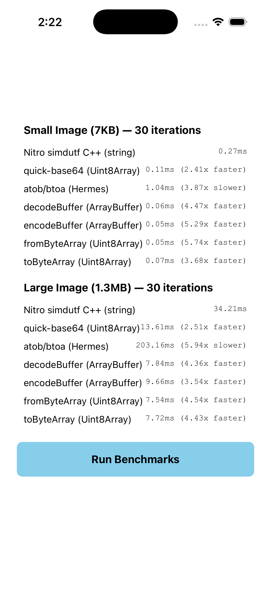
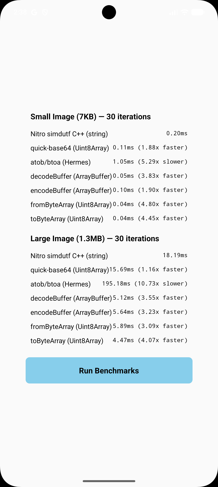

# react-native-nitro-base64 ⚡

The fastest Base64 library for React Native — powered by [simdutf](https://github.com/simdutf/simdutf) SIMD C++ and [Nitro Modules](https://github.com/mrousavy/nitro).

Processes a 1.3MB image **26x faster** than `atob`/`btoa` and **1.8x faster** than `react-native-quick-base64`.

| iPhone | Android |
| --- | --- |
|  |  |

---

## 🤔 Why this library?

Most React Native base64 libraries hit the same bottlenecks:

- 🐢 **Pure JS** (`base64-js`) — slow. No native acceleration.
- ⚠️ **`atob`/`btoa`** — fast for tiny strings, falls apart on binary data at scale.
- ⚠️ **String-based native** — crosses the JSI bridge as UTF-16, doubling memory for binary payloads.

`react-native-nitro-base64` uses SIMD instructions (AVX-512 on x86, NEON on Apple Silicon) to process 64 bytes per CPU instruction, and exposes `ArrayBuffer`/`Uint8Array` APIs that bypass string marshaling entirely.

### 📊 Benchmark — 30 iterations, iPhone (Apple Silicon)

> Tested against `react-native-quick-base64@3.0.0`


#### Small image (7KB)

| Library | Time | vs. nitro-base64 |
|---|---|---|
| ⚡ **nitro-base64** `decodeBuffer` / `fromByteArray` | **0.06ms** | — |
| react-native-quick-base64 | 0.11ms | 1.8x slower |
| atob / btoa (Hermes) | 1.04ms | 17x slower |

#### Large image (1.3MB)

| Library | Time | vs. nitro-base64 |
|---|---|---|
| ⚡ **nitro-base64** `decodeBuffer` / `fromByteArray` | **7.5ms** | — |
| react-native-quick-base64 | 13.6ms | 1.8x slower |
| atob / btoa (Hermes) | 203ms | 26x slower |

---

## 📦 Installation

```sh
yarn add react-native-nitro-base64
yarn add react-native-nitro-modules
```

Then follow [Nitro's setup guide](https://nitro.margelo.com) for autolinking.

### 🔧 Setup

Call `install()` once before your app mounts:

```js
// index.js
import { install } from 'react-native-nitro-base64';
import { AppRegistry } from 'react-native';
import App from './src/App';
import { name as appName } from './app.json';

install();
AppRegistry.registerComponent(appName, () => App);
```

---

## 📖 API

| Function | Input → Output | Notes |
|---|---|---|
| `encode(str, urlSafe?)` | string → base64 string | URL-safe optional |
| `decode(base64)` | base64 string → string | Auto-detects standard & URL-safe |
| `encodeBuffer(ArrayBuffer, urlSafe?)` | ArrayBuffer → base64 string | 🚀 Zero-copy, fastest for images |
| `decodeBuffer(base64)` | base64 string → ArrayBuffer | 🚀 Zero-copy, fastest for images |
| `fromByteArray(Uint8Array, urlSafe?)` | Uint8Array → base64 string | Drop-in for `react-native-quick-base64` |
| `toByteArray(base64)` | base64 string → Uint8Array | Drop-in for `react-native-quick-base64` |

---

## 🚀 Usage

### 🖼️ Images & files — `encodeBuffer` / `decodeBuffer`

Images are binary data. Sending binary through a JS string crosses the JSI bridge as UTF-16, doubling memory. `ArrayBuffer` skips that entirely — raw bytes go straight to C++.

```ts
import { encodeBuffer, decodeBuffer } from 'react-native-nitro-base64';

// Upload image to API
const response = await fetch(imageUri);
const buffer = await response.arrayBuffer();
const base64 = encodeBuffer(buffer); // → "iVBORw0KGgo..."

// Decode API response for <Image> component
const buffer = decodeBuffer(base64String); // → ArrayBuffer
```

### 🔑 Text & JWT — `encode` / `decode`

```ts
import { encode, decode } from 'react-native-nitro-base64';

const encoded = encode('Hello World!');  // "SGVsbG8gV29ybGQh"
const decoded = decode(encoded);         // "Hello World!"

// URL-safe for JWT / URL params
const token = encode(payload, true);
```

### 🔐 Web Crypto & hashing — `fromByteArray` / `toByteArray`

Drop-in replacement for `react-native-quick-base64`. Same API, faster engine.

```ts
import { fromByteArray, toByteArray } from 'react-native-nitro-base64';

// SHA-256 hash → base64
const hash = new Uint8Array(await crypto.subtle.digest('SHA-256', data));
const encoded = fromByteArray(hash);

// base64 → text
const bytes = toByteArray(base64String);
const text = new TextDecoder().decode(bytes);
```

---

## 📱 Platform Support

| Platform | Engine |
|---|---|
| iOS | C++ (simdutf, NEON SIMD) |
| Android | C++ (simdutf, NEON / AVX2 SIMD) |

---

## 📄 License

MIT

## 🙏 Credits

- [simdutf](https://github.com/simdutf/simdutf) — SIMD-accelerated Unicode & Base64
- [Nitro Modules](https://github.com/mrousavy/nitro) — JSI native module framework
